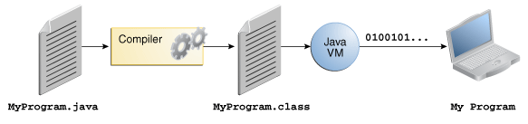
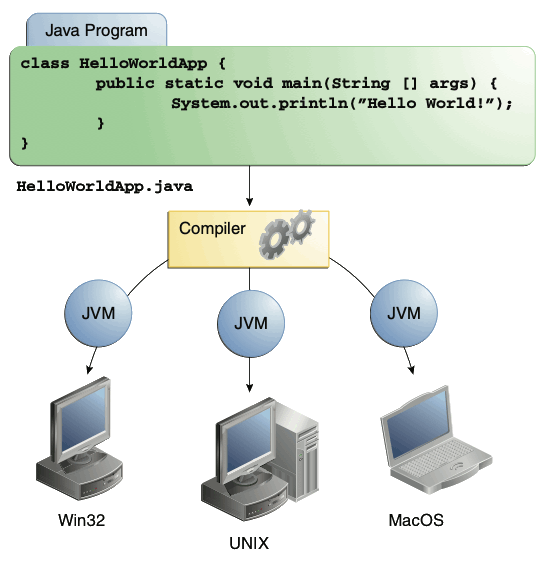
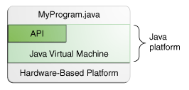
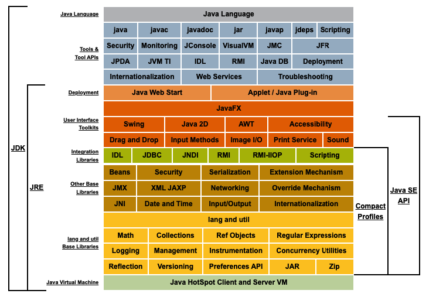

<h1 align="center" style="color:#e74c3c; font-size:2.5em; font-family:sans-serif; margin-bottom:0.5em;">☕ About the Java Technology</h1>

---

<p align="center">
    <span style="display:inline-block; background:#ecf0f1; color:#2c3e50; padding:12px 24px; border-radius:8px; font-size:1.25em; font-weight:500;">
        Java is more than just a programming language—it's a complete platform for building and running applications.
    </span>
</p>

---

## 🚀 Java Language Buzzwords

<div style="display:flex; flex-wrap:wrap; gap:10px;">
<ul style="list-style-type: none; padding:0;">
  <li>🔹 <b>Simple</b></li>
  <li>🔹 <b>Object-oriented</b></li>
  <li>🔹 <b>Distributed</b></li>
  <li>🔹 <b>Multithreaded</b></li>
  <li>🔹 <b>Dynamic</b></li>
  <li>🔹 <b>Architecture-neutral</b></li>
  <li>🔹 <b>Portable</b></li>
  <li>🔹 <b>High-performance</b></li>
  <li>🔹 <b>Robust</b></li>
  <li>🔹 <b>Secure</b></li>
</ul>
</div>

---

## ⚙️ How It Works

<p align="center" style="background:#ffe082; color:#263238; border-radius:10px; padding:18px 24px; box-shadow:0 2px 8px rgba(44,62,80,0.08); font-size:1.15em; font-weight:500;">
    <span style="font-size:1.25em; font-weight:bold; color:#e67e22;">
        Java's magic: <br/> <em>Write your code once, run it anywhere!</em> <br/>
        The Java compiler transforms your code into platform-independent <b>bytecode</b>, allowing seamless execution on any operating system via the JVM. <br/>
        <span style="color:#27ae60;">Portable. Flexible. Effortless deployment.</span>
    </span>
</p>
    <b>How Java Code Runs: Step by Step</b>
    <ol style="text-align:left; max-width:500px; margin:18px auto 0 auto; font-size:1.1em;">
        <li><b>Write your code:</b> All Java source code is written in plain text files with the <code>.java</code> extension.</li>
        <li><b>Compile your code:</b> The <code>javac</code> compiler translates your <code>.java</code> files into <code>.class</code> files.</li>
        <li><b>Bytecode:</b> Each <code>.class</code> file contains <em>bytecode</em>—the special instructions understood by the Java Virtual Machine (JVM).</li>
        <li><b>Run your program:</b> The <code>java</code> command starts the JVM, which loads and runs your bytecode on any supported platform.</li>
    </ol>
</p>

<p align="center">
    <p align="center">
        
        <br/>
        <span style="font-size: 14px; color: #555;">
            <em>
                Java source code (<code>.java</code>) → compiled to bytecode (<code>.class</code>) → executed by JVM on any platform.<br/>
                This process enables "Write once, run anywhere" portability.
            </em>
        </span>
    </p>
</p>

<p align="center" style="background-color: #f4f4f4; color: #2c3e50; padding:10px; border-radius:8px;">
    Because the Java VM is available on many different operating systems, the same <code>.class</code> files are capable of running on Windows, Solaris OS, Linux, or Mac OS.
</p>

<p align="center" style="background-color: #fff; padding: 12px; border-radius: 8px;">
    
</p>

---

## 🖥️ The Java Platform

> <b>A platform</b> is the hardware or software environment in which a program runs.

Most platforms = OS + hardware (Windows, Linux, Solaris OS, Mac OS)

Java platform is <b>software-only</b> and runs on top of other hardware-based platforms.

### Java Platform Components

- <b>Java Virtual Machine (JVM)</b>: The base for the Java platform, ported onto various hardware-based platforms.
- <b>Java Application Programming Interface (API)</b>: A large collection of ready-made software components grouped into packages.
<p align="center">
    
</p>

<p align="center"><em>The API and Java Virtual Machine insulate the program from the underlying hardware.</em></p>

<p align="center">
    
    <br/>
    <span style="font-size: 14px;"><em>Description of Java Conceptual Diagram</em></span>
</p>

---

## ⚡ Performance & Portability

As a platform-independent environment, the Java platform can be a bit slower than native code. However, advances in compiler and VM technologies are bringing performance close to native code without threatening portability.

### 📊 Performance Metrics

- **Startup Time:** Java applications typically have a startup time of 100–500 ms, while native C/C++ apps may start in under 50 ms.
- **Execution Speed:** Modern JVMs (with JIT compilation) can achieve 80–95% of native C/C++ performance for compute-intensive tasks.
- **Memory Usage:** Java applications often require more memory (heap + JVM overhead), e.g., a simple Java app may use 30–50 MB RAM, while a similar C app uses 1–5 MB.
- **Garbage Collection Pause:** JVM garbage collection can introduce pauses of 10–200 ms, depending on heap size and GC algorithm.
- **Portability:** Java bytecode runs unchanged on Windows, Linux, macOS, and many embedded systems; native code must be recompiled for each platform.

> **Summary:** Java trades a small amount of raw speed for seamless portability and easier cross-platform development. For most business and web applications, the performance difference is negligible due to JVM optimizations.

---

## 🌍 In-Depth Look at Platform Independence

<p align="center">
    <span style="font-size:2em; font-weight:bold; color:#27ae60;">
        “Write once, run anywhere.”
    </span>
</p>

Java is platform-independent because Java programs are converted into <b>bytecode</b>, which runs on the JVM. Since the JVM is developed separately for each OS, Java code can run the same way in any environment.

---

### 💻 What Are Platform-Dependent Languages?

Platform-dependent languages generate machine code specific to the OS/hardware when compiled. A program compiled on one OS usually does not run on another.

<table>
<thead>
<tr><th>Language</th><th>Why Platform Dependent</th><th>Explanation</th></tr>
</thead>
<tbody>
<tr><td><b>C</b></td><td>Compiler generates OS-specific machine code</td><td>An <code>.exe</code> compiled on Windows will not run on Linux</td></tr>
<tr><td><b>C++</b></td><td>Produces platform-specific machine code</td><td>Needs to be recompiled for each platform</td></tr>
<tr><td><b>C# (partially)</b></td><td>Dependent on .NET Framework</td><td>Became cross-platform with .NET Core/.NET 5+, but some parts are still Windows-specific</td></tr>
<tr><td><b>Objective-C</b></td><td>Special compilers for macOS/iOS</td><td>Rarely works outside Apple ecosystem</td></tr>
<tr><td><b>Swift</b></td><td>Originally Apple platform-specific</td><td>Now supports Linux, but mainly focused on Apple</td></tr>
<tr><td><b>Visual Basic</b></td><td>Tightly coupled to Windows APIs</td><td>Does not run on other OS</td></tr>
<tr><td><b>Delphi (Pascal)</b></td><td>Compilers targeting Windows</td><td>Needs different tools for other systems</td></tr>
</tbody>
</table>

---

### 🔁 Examples of Platform-Independent Languages

<table>
<thead>
<tr><th>Language</th><th>Platform Independence Method</th></tr>
</thead>
<tbody>
<tr><td><b>Java</b></td><td>Runs on the JVM</td></tr>
<tr><td><b>Python</b></td><td>Interpreter works on every platform</td></tr>
<tr><td><b>JavaScript</b></td><td>Runs in browsers or Node.js</td></tr>
<tr><td><b>PHP</b></td><td>Runs on any platform via a web server</td></tr>
<tr><td><b>Go</b></td><td>Can be compiled for different platforms from one codebase</td></tr>
</tbody>
</table>

---

## 🆚 Java vs. C: Platform Independence vs. Dependence

Below is a simple example showing the difference in platform dependence between Java and C 👇

### ☕ Java Example (Platform Independent)

```java
// Hello.java
public class Hello {
    public static void main(String[] args) {
        System.out.println("Hello, World!");
    }
}
```

<b>Compilation Step:</b>

```bash
javac Hello.java
```
Produces <code>Hello.class</code> (bytecode, not OS-specific)

<b>Execution Step:</b>

```bash
java Hello
```

✅ Runs on Windows, macOS, Linux, Android (JVM-based) without changes.

---

### ⚙️ C Example (Platform Dependent)

```c
// hello.c
#include <stdio.h>

int main() {
    printf("Hello, World!\n");
    return 0;
}
```

<b>Compilation Step:</b>

For Windows:
```bash
gcc hello.c -o hello.exe
```
For Linux:
```bash
gcc hello.c -o hello
```

<b>Execution Step:</b>
- <code>hello.exe</code> runs on Windows
- <code>./hello</code> runs on Linux
- Separate compilation needed for macOS

❌ Compiled program on one OS will not run on another without recompilation.

---

### 🔍 Summary Comparison

<table>
<thead>
<tr><th>Feature</th><th>Java</th><th>C</th></tr>
</thead>
<tbody>
<tr><td>Compilation type</td><td>Bytecode (intermediate code)</td><td>Machine code</td></tr>
<tr><td>Runtime environment</td><td>JVM (available everywhere)</td><td>OS-specific</td></tr>
<tr><td>One code, all platforms</td><td>✅ Yes</td><td>❌ No</td></tr>
<tr><td>Performance</td><td>Medium-high</td><td>Very high</td></tr>
<tr><td>Flexibility</td><td>Platform independent</td><td>Platform dependent</td></tr>
</tbody>
</table>

---


