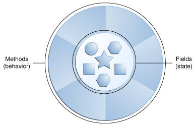
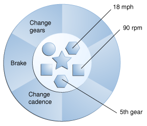
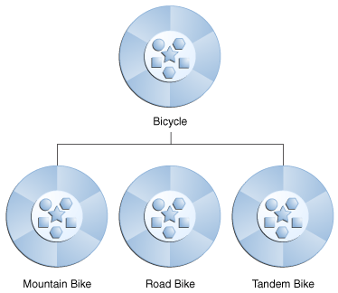

# Object-Oriented Programming Concepts
Object-Oriented Programming is a programming approach that models software using objects. 

The goal is to write more understandable, modular, and reusable code by representing real-world entities in a programming language.
## What Is an Object?
Objects are key to understanding object-oriented technology.

<p align="center">
        
</p>


Real-world objects share two characteristics: They all have state and behavior.
### Let's look at a bicycle as an example of an object.

Bicycles have state and behavior

**State**:
* current gear
* current pedal cadence
* current speed

**Behavior**:
* changing gear
* changing pedal cadence
* applying brakes


<p align="center">
        
</p>


By attributing state (current speed, current pedal cadence, and current gear) and providing methods for changing that state


## What Is a Class?
There may be thousands of other bicycles in existence, all of the same make and model.

Each bicycle was built from the same set of blueprints and therefore contains the same components.

In object-oriented terms, we say that your bicycle is an instance of the class of objects known as bicycles.

A class is the blueprint from which individual objects are created.

## What Is Inheritance?

<p align="center">
        
</p>


Object-oriented programming allows classes to inherit commonly used state and behavior from other classes. In this example, Bicycle now becomes the superclass of MountainBike, RoadBike, and TandemBike. In the Java programming language, each class is allowed to have one direct superclass, and each superclass has the potential for an unlimited number of subclasses.


## What Is an Interface?

In its most common form, an interface is a group of related methods with empty bodies. A bicycle's behavior, if specified as an interface, might appear as follows:
```java
public interface Bicycle {
    // wheel revolutions per minute
    void changeCadence(int newValue);
    void changeGear(int newValue);
    void speedUp(int increment);
    void applyBrakes(int decrement);
}
```


## What Is a Package?
A package is a namespace that organizes a set of related classes and interfaces. Conceptually you can think of packages as being similar to different folders on your computer. You might keep HTML pages in one folder, images in another, and scripts or applications in yet another. Because software written in the Java programming language can be composed of hundreds or thousands of individual classes, it makes sense to keep things organized by placing related classes and interfaces into packages.


